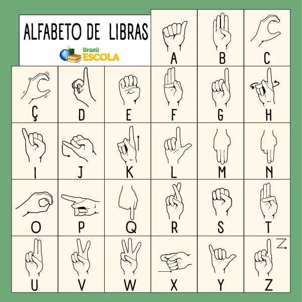

# 🤟 Lexi - Reconhecimento de Sinais de LIBRAS com Python

Este projeto utiliza **OpenCV** e **MediaPipe** para detectar mãos via webcam e reconhecer **algumas letras do alfabeto em LIBRAS (Língua Brasileira de Sinais)** com base nas posições dos dedos.

⚠️ **Letras atualmente reconhecidas:**  
A, B, C, D, E, F, G, H, I, K, L, M, N, O, R, S, T, U, V, W, Y.

> As letras J, P, Q, X e Z ainda **não são suportadas** devido a limitações no reconhecimento de movimento e orientação.


## 📦 Requisitos

- Python `3.11.7`

Instale as dependências com:

```bash
pip install -r requirements.txt
```
Rodar o projeto: 
```bash
python main.py
```

## ✋ Como fazer as letras:
Referência visual das posições das mãos para formar cada letra:

()

## ⚙️ Adaptações de sinais

Algumas letras tiveram seus sinais ajustados para melhor compatibilidade com o MediaPipe, que apresenta limitações na detecção de profundidade e alguns movimentos finos. Veja as adaptações abaixo:

C / O: Mantêm os sinais tradicionais, mas funcionam apenas com a mão esquerda.

F: Apenas o dedo indicador deve estar abaixado.

H: Mantenha apenas os dedos indicador e mindinho esticados.

K: Estique os dedos indicador, anelar e polegar.

M: Mantenha todos os dedos esticados.

N: Apenas o mindinho deve estar abaixado.

T: Abaixe os dedos indicador e polegar.

Feito com 💙 para promover acessibilidade com tecnologia.
